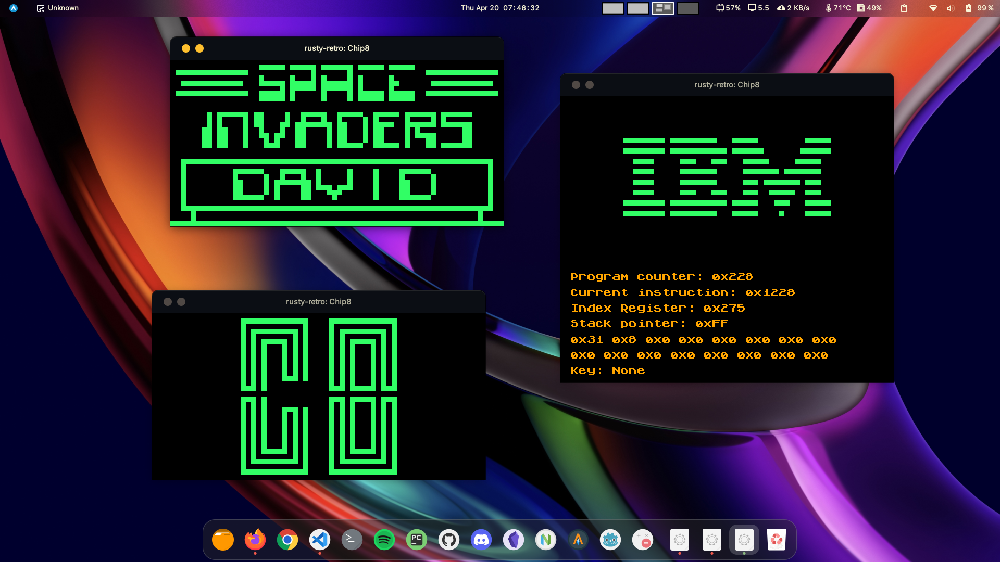

# **Retro system emulators written in Rust**

### _*CHIP8*_:

[How to run on local machine?](./chip8/CHIP8.md)

## **References**

1. https://youtu.be/jWpbHC6DtnU
2. https://bugzmanov.github.io/nes_ebook/
3. https://multigesture.net/articles/how-to-write-an-emulator-chip-8-interpreter/
