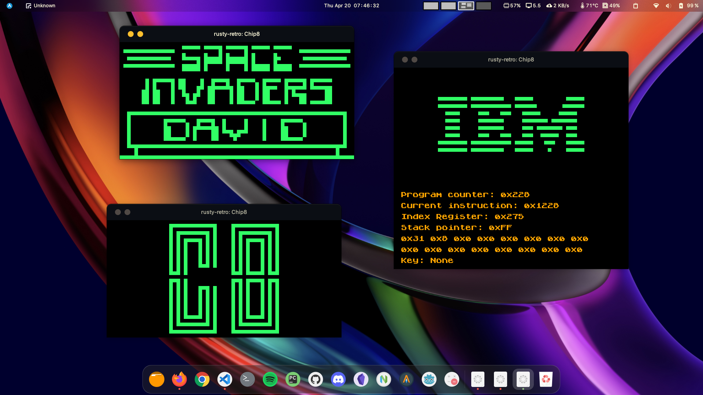

# Chip-8 emulator written in Rust



## **How to run?**

- #### _*Using precompiled binaries*_
  The binaries are already compiled in the `binaries` folder. Navigate to the correct platform and run the executable along with the path of the rom to be run.

Example:

1. Clone the repo.

```
git clone https://github.com/rumbleFTW/rusty-retro.git
```

2. Navigate to the appropriate platform.

```
cd rusty-retro/binaries/winx86
```

3. Run the precompiled binary along with the path of the rom.

```
./chip8 --rom=../../chip8/roms/INVADERS
```

- #### _*Using cargo*_

If cargo is already installed, then the emulators can be run using cargo run.

Example:

1. Clone the repo.

```
git clone https://github.com/rumbleFTW/rusty-retro.git
```

2. Navigate to the appropriate emulator.

```
cd rusty-retro/chip8/
```

3. Run with cargo along with the path of the rom.

```
cargo run -- --rom=./roms/PONG -d
```

## **Flags and Args**

1. `-d`: Debug mode; shows internal values of registers and flags
2. `--rom=<path_to_rom>`: Which rom to load and run

## About


> CHIP-8 was created by RCA engineer Joe Weisbecker in 1977 for the COSMAC VIP microcomputer. It was intended as a simpler way to make small programs and games for the computer. Instead of using machine language for the VIP’s CDP1802 processor, you could type in hexadecimal instructions (with the VIP’s hex keypad) that resembled machine code, but which were more high-level, and interpreted on the fly by a small program (the CHIP-8 emulator/interpreter).

> CHIP-8 soon spread to other computers, like the Finnish Telmac 1800, the Australian DREAM 6800, ETI-660 and MicroBee, and the Canadian ACE VDU.

> By 1984 the interest in CHIP-8 petered out. However, in 1990 it had a renaissance on the HP48 graphing calculators with CHIP-48 and the now-famous SUPER-CHIP extension with higher resolution.
